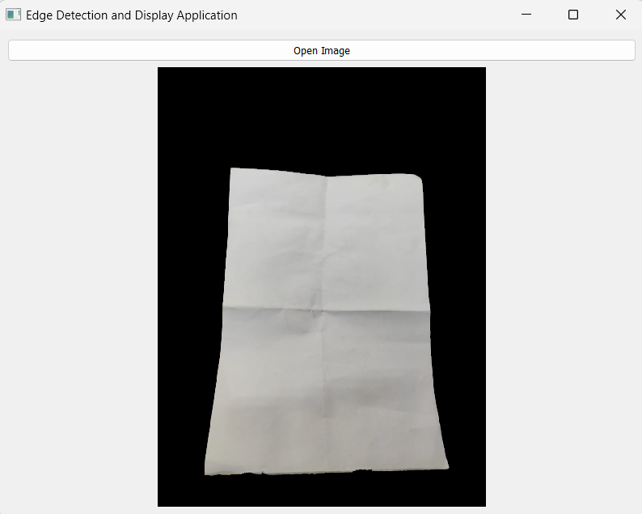

# edge_detcetion
A python application to detect page from the given image and show the cropped page from the image by making background as black
INPUT IMAGE
![INPUT IMG] (Screenshot 2023-12-28 114410.png);
RESULT

